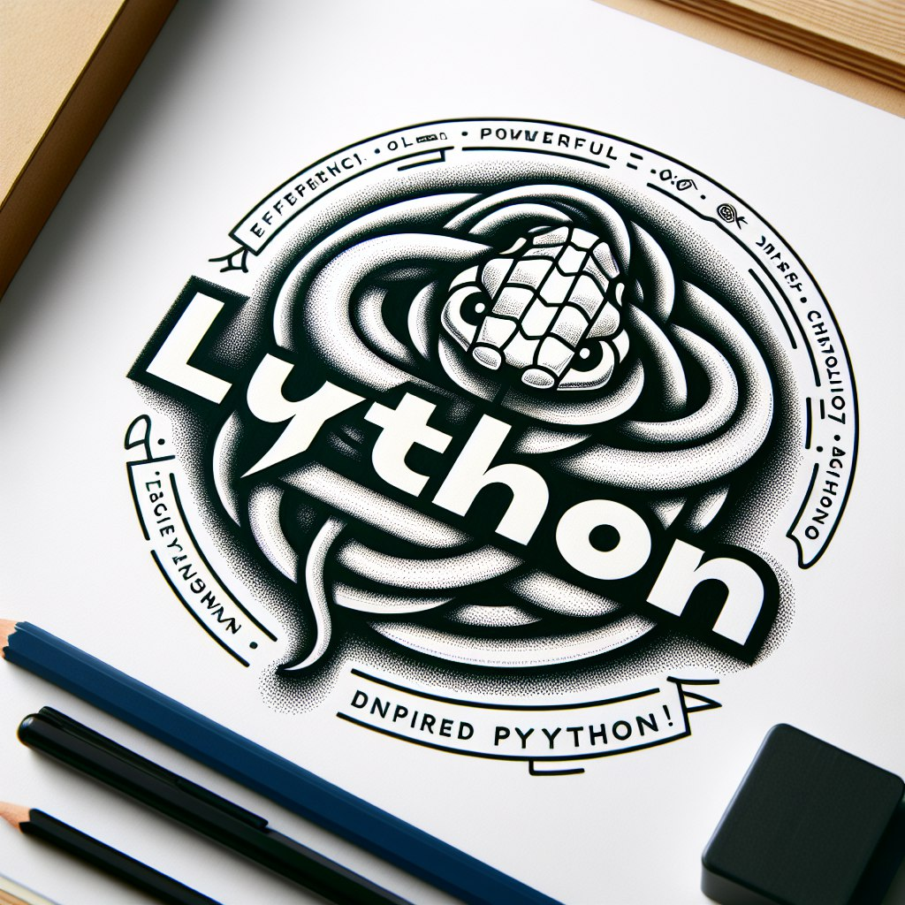

[](https://github.com/guangrei/lython/actions) 
[](https://github.com/guangrei/lython/actions)
[](https://pepy.tech/project/programminglython)
[](https://github.com/psf/black)

Python is a great programming language, but sometimes the indentation can be terrible for some people (especially people with visual impairments).

So i created `Lython` and  replace the indentation with `lua-style` code block. 



Lython has advanced features like

- syntax checker

- optimized run and import with `py_compile`

- implement `__lycache__` to make compiler only compiling when the source files changes.

- respect docstring and doctring variable in parser.

- repl mode

- deploy scheme

example lython code:

```python
def test(num)
    for i in range(num) do
        if i == 0 then
            print("zero")
        elif i % 2 == 1 then
            print("odd")
        else
            print("even")
        end # if else
    end # for
end # def

test(10)
```

for more example, check the `examples` directory.

Note:

- The indentation in the code above is just to make the code look pretty and has no effect on the parser.

- you cant use `then`, `do`, `end` as name variable, function and class in lython.

## Installation & usage

to install lython with `pip`, type

```
pip install programminglython
```
install from repository
```
pip install --upgrade https://github.com/guangrei/lython/archive/main.zip
```
available commands
```
% lython -h
usage: lython [-h] [-d] [-c] [-l] [-p] [-V] [path]

Lython programming language built on top of CPython

positional arguments:
  path           The path to the .ly file

optional arguments:
  -h, --help     show this help message and exit
  -d, --debug    Debug mode
  -c, --compile  Compile your Lython project for deployment
  -l, --lint     Syntax check only
  -p, --print    Print the code only
  -V, --version  Show Lython version
```

run script
```
% lython script.ly
```
or
```
% python -m Lython.Console script.py
```

## Import

use `require` function to import `.ly` file, for example

```python
from Lython.util import require

mod = require("test.ly")
```
you can import specific attribute
```python
mod = require("test.ly", ["test"])
```
or multiple attribute
```python
a, b, c = require("test.ly", ["a", "b", "c"])
```
by default root directory in require function, resolved to `Lython.util.script_path()` but you can change it, for example
```
mod = require("test.ly", root="your/custom/path")
```

## Repl

to use repl mode, type
```
% lython
```
or
```
% python -m Lython.Console
```
in the repl mode you can use `require` function directly (no need import)

## Deploy

in your server, run command
```
% lython -c your_main.ly
```
this will generate your\_main.pyc and build `__lycache__` recursively.

now you can run your\_main.pyc with normal python interpreter.

if you cant run command above in your server, you can build it locally with command
```
% LYTHONOPTIMIZE=0 lython -c your_main.ly
```
this will produce file `.py` instead `.pyc`.

at last, add environment variable in your server

- `LYTHONOPTIMIZE=1` for pyc 

- `LYTHONOPTIMIZE=0` for py

- `LYTHONPRODUCTION=1` to improve require function in production


tested on gcp and vercel.
